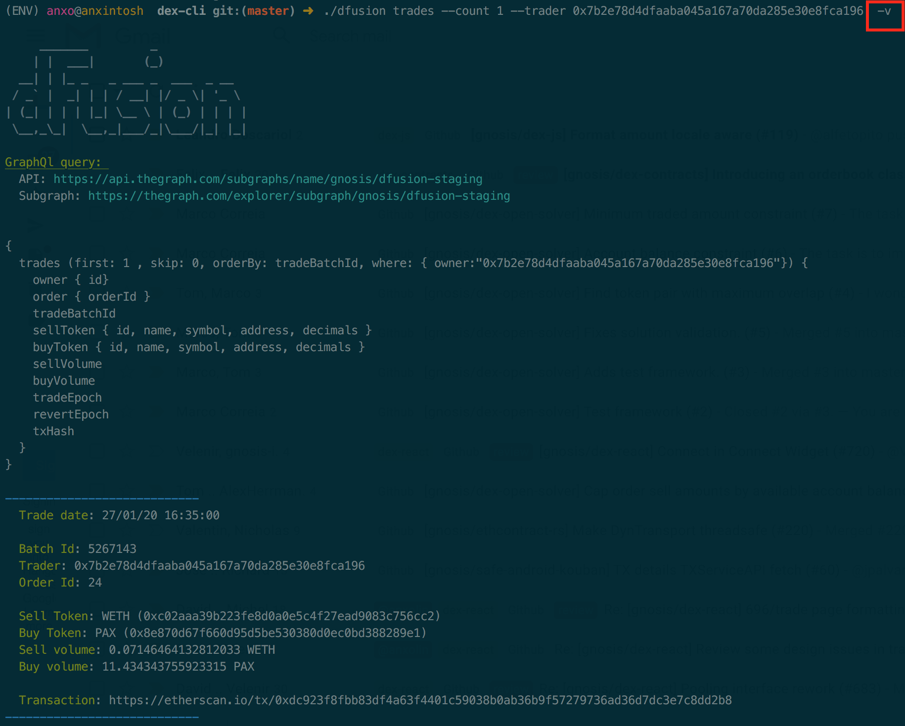

# Gnosis Protocol CLI


## Setup

```bash
# Setup virtual env
python3 -m venv ENV
source ./ENV/bin/activate

# Install dependencies
pip install -r requirements.txt
```

## Basic commands

```bash
# help command
./gnop --help
./gnop

# Get trades
./gnop trades

# Get first 5 trades
./gnop trades --count 5 --skip 0

# Filter by trader
./gnop trades --trader 0x7b2e78d4dfaaba045a167a70da285e30e8fca196
```

## Different Networks

The cli supports mainnet (default), rinkeby and xdai. To specify a network you need to:

```bash
export NETWORK=xdai
./gnop trades --count 5 --skip 0

# Or
export NETWORK=rinkeby
./gnop trades --count 5 --skip 0
```

## Debug - Verbose

Verbose mode prints information that is useful for debugging, including the GraphQL query and the url for the endpoint and subgraph:

```
# Verbose mode (-v)
./gnop trades -v
```



## Development

If you use Visual Studio code, make sure you install https://marketplace.visualstudio.com/items?itemName=ms-python.python plugin to auto-organize imports on save:

```
{
  "editor.codeActionsOnSave": {
    "source.organizeImports": true
  }
}
```

To organize the imports manually run:

```bash
isort -rc */**.py

# Check coverage
coverage run -m pytest && coverage report
```
